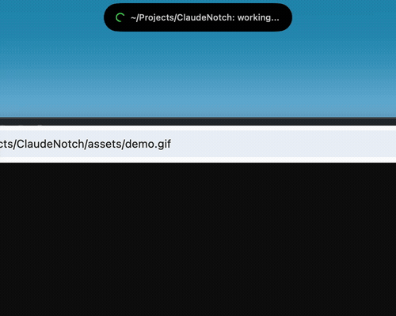

# ClaudeNotch

A macOS notch widget that monitors [Claude Code](https://docs.anthropic.com/en/docs/claude-code) sessions in real time. See live status, approve tool use, review plans, and jump to the right terminal tab — all from your menu bar.



## What it does

- **Live session status** in a Dynamic Island-style notch overlay (green = working, yellow = needs approval, red = finished)
- **Approve or deny** tool use requests directly from the notch — no need to switch to the terminal
- **"Always Allow"** to add permanent permission rules for trusted commands
- **Jump to the right terminal tab** with one click or the global hotkey (supports Ghostty, Terminal.app, iTerm2, Kitty)
- **Prevent sleep** while Claude is working
- **Review plans** inline when Claude proposes an implementation
- **See URLs** Claude wants to fetch, clickable to open in your browser
- **Customizable** font size and notch width

## Requirements

- macOS 14.0+ (Sonoma)
- Apple Silicon
- [Claude Code](https://docs.anthropic.com/en/docs/claude-code) CLI

## Setup

### 1. Build and run

```bash
git clone https://github.com/hezi/ClaudeNotch.git
cd ClaudeNotch
open ClaudeNotch.xcodeproj
# Build and run (Cmd+R) in Xcode
```

Or build from the command line:

```bash
xcodebuild -project ClaudeNotch.xcodeproj -scheme ClaudeNotch -configuration Release build
```

### 2. Add hooks to Claude Code

Add the following to `~/.claude/settings.json` (or use the built-in **Setup Hooks** button in the app):

```json
{
  "hooks": {
    "UserPromptSubmit": [
      {
        "matcher": "",
        "hooks": [
          {
            "type": "command",
            "command": "curl -s --connect-timeout 1 -X POST -H 'Content-Type: application/json' -d @- http://localhost:7483/hook/UserPromptSubmit || true"
          }
        ]
      }
    ],
    "SessionStart": [
      {
        "matcher": "",
        "hooks": [
          {
            "type": "command",
            "command": "curl -s --connect-timeout 1 -X POST -H 'Content-Type: application/json' -d @- http://localhost:7483/hook/SessionStart || true"
          }
        ]
      }
    ],
    "SessionEnd": [
      {
        "matcher": "",
        "hooks": [
          {
            "type": "command",
            "command": "curl -s --connect-timeout 1 -X POST -H 'Content-Type: application/json' -d @- http://localhost:7483/hook/SessionEnd || true"
          }
        ]
      }
    ],
    "PreToolUse": [
      {
        "matcher": "",
        "hooks": [
          {
            "type": "command",
            "command": "curl -s --connect-timeout 1 -X POST -H 'Content-Type: application/json' -d @- http://localhost:7483/hook/PreToolUse || true"
          }
        ]
      }
    ],
    "PostToolUse": [
      {
        "matcher": "",
        "hooks": [
          {
            "type": "command",
            "command": "curl -s --connect-timeout 1 -X POST -H 'Content-Type: application/json' -d @- http://localhost:7483/hook/PostToolUse || true"
          }
        ]
      }
    ],
    "Stop": [
      {
        "matcher": "",
        "hooks": [
          {
            "type": "command",
            "command": "curl -s --connect-timeout 1 -X POST -H 'Content-Type: application/json' -d @- http://localhost:7483/hook/Stop || true"
          }
        ]
      }
    ],
    "Notification": [
      {
        "matcher": "",
        "hooks": [
          {
            "type": "command",
            "command": "curl -s --connect-timeout 1 -X POST -H 'Content-Type: application/json' -d @- http://localhost:7483/hook/Notification || true"
          }
        ]
      }
    ],
    "PermissionRequest": [
      {
        "matcher": "",
        "hooks": [
          {
            "type": "command",
            "command": "curl -s --max-time 120 -X POST -H 'Content-Type: application/json' -d @- http://localhost:7483/hook/PermissionRequest || true",
            "timeout": 120
          }
        ]
      }
    ]
  }
}
```

All hooks use `|| true` so they fail silently when ClaudeNotch isn't running.

## Features

### Notch Overlay

A floating pill at the top of your screen shows the current state of your Claude Code sessions:

| State | Color | Meaning |
|-------|-------|---------|
| Working | Green spinner | Claude is running tools |
| Awaiting Approval | Yellow pulse | Claude needs permission to proceed |
| Ready | Red pulse | Claude finished, waiting for your next prompt |
| Complete | Green check | Session ended |
| Idle | Gray dot | No activity |

Hover to expand and see all active sessions. Click any session to jump to its terminal tab.

### Permission Control

When Claude needs approval to run a tool, the notch shows the tool name and command/file path with action buttons:

- **Allow** — approve this one request
- **Always** — approve and add a permanent rule to project settings (never ask again for this command)
- **Deny** — reject the request
- **Skip** — dismiss and let the normal CLI prompt handle it

### Plan Review

When Claude proposes an implementation plan (`ExitPlanMode`), the notch shows a blue-themed card with:
- A preview of the first few lines of the plan
- **Approve** / **Reject** buttons
- **Open** button to view the full plan in your editor

### Terminal Navigation

Click any session row to activate the correct terminal tab. The app detects which terminal owns each Claude Code process by walking the parent PID chain.

| Terminal | Method |
|----------|--------|
| Ghostty | AppleScript — matches by TTY, tab name, and working directory |
| Terminal.app | AppleScript — matches by TTY device |
| iTerm2 | AppleScript — matches by TTY device |
| Kitty | `kitten @ focus-window --match pid:<pid>` |

Requires Automation permission (grant via Settings > Permissions).

### Global Hotkey

Press **Option+Shift+C** from anywhere to jump to the most urgent session's terminal. Sessions are prioritized: approval needed > working > ready > idle.

### Sleep Prevention

Toggle in settings to prevent macOS from sleeping while any Claude Code session is actively working. Uses `IOPMAssertionCreateWithDescription`.

### Auto-Expand on Approval

Enable in Settings > General to automatically expand the notch overlay when a permission request comes in, so you see the details without hovering.

### Process Detection

On launch, ClaudeNotch reads `~/.claude/sessions/*.json` to detect already-running Claude Code sessions. No need to restart your sessions — they appear immediately with correct names and elapsed times.

## Settings

### General
| Setting | Default | Description |
|---------|---------|-------------|
| Prevent sleep | On | Block macOS sleep while Claude is working |
| Play sound | On | Alert sound on state changes |
| Auto-expand on approval | Off | Auto-expand notch when approval needed |
| Launch at login | Off | Start ClaudeNotch when you log in |

### Appearance
| Setting | Default | Description |
|---------|---------|-------------|
| Show status text | On | Display text in the collapsed notch bar |
| Fit width to text | Off | Expand notch pill to fit label instead of fixed width |
| Font size | M | Scale all notch text (System, XS, S, M, L, XL, XXL) |

### Server
| Setting | Default | Description |
|---------|---------|-------------|
| Port | 7483 | Local HTTP server port for hooks |

## Architecture

```
ClaudeNotch/
  App/
    ClaudeNotchApp.swift      # @main, MenuBarExtra entry point
    AppState.swift             # Central coordinator, window management, global hotkey
  Models/
    Session.swift              # Session state machine and model
    HookEvent.swift            # Hook payload types and JSON decoding
  Server/
    HookServer.swift           # NWListener HTTP server, permission decision handling
    HTTPParser.swift           # Minimal HTTP/1.1 request parser
  Services/
    SessionManager.swift       # Session lifecycle, state transitions, tool summary extraction
    ProcessScanner.swift       # Detect running sessions from ~/.claude/sessions/
    TerminalActivator.swift    # AppleScript/CLI terminal tab activation
    SleepManager.swift         # IOKit sleep assertion
    NotificationManager.swift  # UNUserNotificationCenter alerts
  Views/
    NotchOverlay.swift         # Dynamic Island-style floating overlay
    MenuBarView.swift          # Menu bar dropdown with session list and controls
    SettingsView.swift         # Settings window (General, Appearance, Server, Permissions)
    OnboardingView.swift       # Hooks setup guide with copy-to-clipboard
  Utilities/
    NotchWindow.swift          # NSPanel configured as floating overlay
    Constants.swift            # Default port, UserDefaults keys
```

Zero external dependencies. Built entirely on Apple frameworks: Network, IOKit, UserNotifications, AppKit, SwiftUI.

## License

MIT
